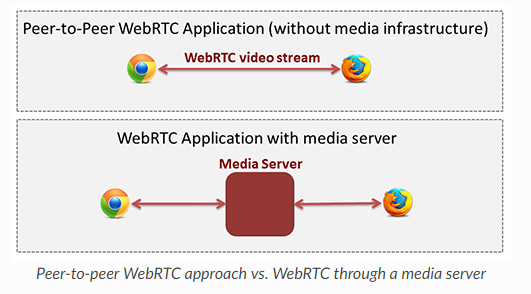
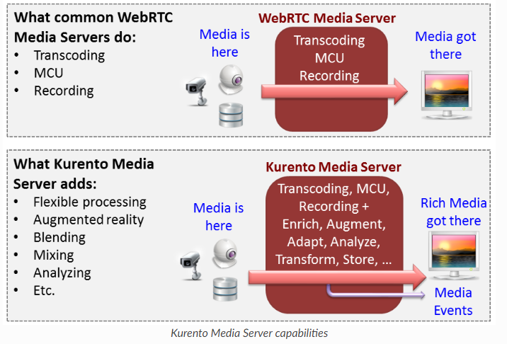
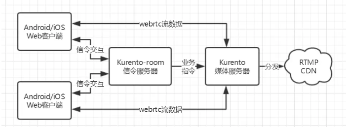

地址：[http://www.kurento.org](http://www.kurento.org/)

github：<https://github.com/Kurento>

### 介绍

Kurento是一个WebRTC媒体服务器和一组客户端API，可以简化浏览器和移动端平台的高级音视频应用开发.Kurento媒体服务器包括通信，转码，录制，混合，广播和路由.作为差异化功能,Kurento 媒体服务器还提供先进的媒体处理能力，包括计算机视觉，视频索引，增强现实,和语音分析.Kurento模块化架构简化了第三方媒体处理算法(语音识别，情感分析，人脸识别等)的集成.

Kurento提供了一个多媒体开发框架，提供了以下几个功能：

Dynamic WebRTC Media pipelines：Kurento

Clinet/Server架构：Kurento Meida Server(KMS)是服务端,提供WebSocket接口.

Java and JavaScript Client Applications：KMS包括三层体系结构,用户浏览器通过中间客户端与KMS服务器交互,客户端支持Java和JavaScript的使用.

Third party Modules：支持第三方模块的兼容.比如 计算机视觉,增强现实等。

#### WebRTC media servers

WebRTC是一组协议，机制和APIs提供了浏览器和移动端点对点实时通信.优势就是不使用插件就可以实现点对点通信,但是局限性在于不能群组通信，媒体流记录，媒体广播，或媒体转码之类功能.

从概念上讲，WebRTC媒体服务器只是一个多媒体中间件，当从源到目的地时，媒体流量会通过.媒体服务器可以实现传入的媒体流和不同的传出结果比如：

#### Kurento Media Server

kurento的主要组件是Kurento Media Server(KMS)负责媒体传输，处理，录制，播放，KMS建立在GStreamer多媒体库之上提供如下功能：

网络流媒体协议，包括HTTP,RTP，WebRTC。

多组通信时支持媒体混合以及路由调度.

对计算机视觉和增强现实算法过滤器的通用支持.

媒体存储，支持WebM和MP4的写入操作,并一GStreamer支持的所有格式播放.

GStreamer支持任何编解码器之间的自动媒体转码.VP8，h264，AMR，OPUS，Speex,G.711等.

#### Kurento Design Principles

单独的信令和媒体层面

分发媒体和应用程序服务：Kurento媒体服务器和应用程序可以在不同的计算机之间布置,单个应用程序可以调用多个KMS的服务,相反一个KMS可以参加多个应用程序的调用.

适合云端：Kurento适合集成到云端，充当PaaS组件.

媒体管道：通过媒体管道链接媒体元素是一种挑战多媒体处理复杂性的直观方法.

应用开发：开发人员无需了解KMS的内部的负责性.

端到端通信能力：Kurento提供端到端通信功能，因此开发人员无需处理客户端设备上传输，编码/解码和渲染媒体的复杂性.

完全可处理的媒体流：交互式通信.

媒体的模块化处理：

可审计处理：能够为QoS监控.

#### About OpenVidu

OpenVidu：是一个新的工程来至于创建Kurento的团队，包含了大部分Kurento Meida Srever的功能,相当于更简单.但是如果需要针对媒体复杂处理建议还是使用Kurento.

地址：<https://openvidu.io/>

#### Kurento搭建

通过Kurento提供的不同平台的客户端,可以创建兼容的媒体服务器.

#### Kurento教程

利用Kurento框架构建不同类型的WebRTC和多媒体应用程序.分为三种形式

Java：

JavaScript：

nodejs：客户端与Node.js服务器进行交互,应用程序服务器保存逻辑，协调客户端之间的通信并为其控制Kurento Media Server功能.利用了三层架构的原理，都是使用的webSocket,首先在客户端和应用服务器(node.js搭建)之间创建WebScoket实现自定义信令协议,其次,另一个WebSocket用于执行Kurento JavaScript客户端(node.js内部调用)和Kurento媒体服务器之间的通信.此通信使用Kurento协议进行.

总结

Kurento相对来说相对复杂.但是功能齐全.资料详细.只能安装linux系统.

