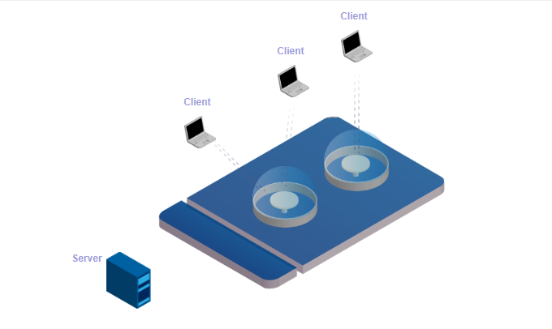

地址：<http://lynckia.com/licode/index.html>

github：<https://github.com/lynckia/licode>

介绍

开源的WebRTC通信平台.基于WebRTC技术，与最新最稳定的Google Chrome完全兼容.能够通过Web浏览器进行通话，无需任何插件.简单，快速可扩展，无需关心复杂的基础架构.

模块

Erizo：WebRTC的MCU，利用C++编写,完全兼容WebRTC协议.

Erizo API：针对Erizo的封装使用与Node.js

Erizo Controller：服务核心,提供会议室用于多方会议.

Nuve：视频会议管理API,为第三方应用程序提供视频会议管理。

server：服务端通过Nuve模块(左边蓝色快)用于创建和销毁房间,并创建房间访问令牌,该令牌用于客户端使用

Nuve(左边蓝色模块)：服务端通过该模块用于请求管理Licode会议室.

Erizo（右边蓝色模块）：客户端通过Erizo服务将用户连接到房间.开发人员在浏览器中运行JavaScript库来管理此模块.Erizo Controller通过一个名字为ErizoAPI的JavaScript包装器来管理Erizo.

Room(椭圆形模块)：一个房间中的所有用户和客户端都可以通过Licode共享流.房间由Nuve创建,用户通过Erizo连接到房间,房间由Erizo Controller控制通过名字为ErizoAPI的JavaScript包装器控制.

client()：在浏览器上运行JavaSript应用程序,访问Licode会议室.需要服务端创建房间时的令牌.

总体理解如下：客户端通过ErizoAPI调用,通过信令传输到Erizo Controller模块,而Erizo Controller模块解析相关信令用于操作Erizo模块.Erizo模块用于和房间模块进行相互调用.

总结

Licode前端目前只有js.