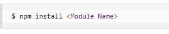
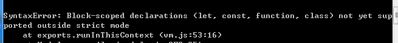
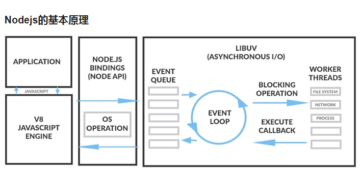
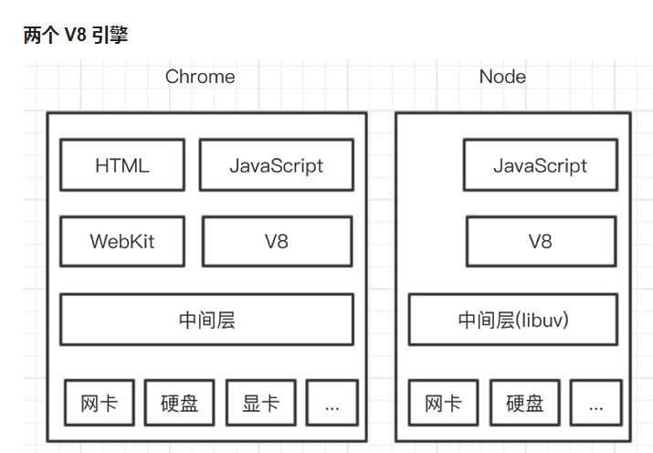
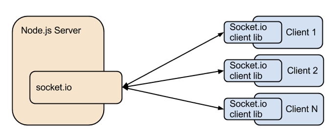
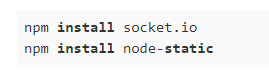

利用Nodejs搭建一个信令服务器

下载地址：

最新版本：<https://nodejs.org/en/>

Node.js现在是非常流行的Web服务器,是一个基于Chrome V8引擎的JavaScript运行环境,使用了一个事件驱动，非阻塞式I/O的模型,使其轻量又高效.NPM是随同NodeJS一起安装的包管理工具，能解决NodeJS代码部署上的很多问题,常见的场景有以下几种：

1：允许用户从NPM服务器下载别人编写的第三方包到本地使用.

2：允许用户从NPM服务器下载并安装别人编写的命令行程序到本地使用.

3：允许用户将自己编写的包或命令行程序上传到NPM服务器供别人使用.

新版nodejs已经集成了npm。使用npm命令安装模块语法如下：

下载最新Nodejs版本，否则运行node ***.js出现如下问题

nodejs的原理如上所示,其核心是V8引擎,通过该引擎,可以让js调用c/c++方法或对象,

如上图所示,在我们使用Nodejs之后实际存在两个V8引擎,一个V8引擎用户解析服务端的JS应用程序,另一个为浏览器中的V8引擎,用于控制浏览器行为.在服务端至少要存放两个js脚本，一个是服务端程序控制Nodejs的行为，另一个是客户端程序，它主要是由浏览器请求后，下发到浏览器，由浏览器中的V8引擎进行解析处理.用户浏览器输入某个线上地址，然后下载下来客户端js脚本，然后客户端通过js脚本进行与远端服务器进行通信.

当前demo是利用socket.io库来实现信令服务器,因为socket.io具有房间的概念,非常符合webRtc.

socket.io与Nodejs配合逻辑图,非常简单,socket.io分为客户端和服务端两部分,服务端由Nodejs加载后侦听某个服务端端口,客户端想要与服务端相连，首先要加载socket.io的客户端库.

当前src/nodejs信令服务器/文件夹下，创建server.js和js文件夹

,然后利用npm在server.js当前路径下下载使用的模板库.

demo运行：

node server.js启动server服务器.

打开浏览器输入localhost：2013

google启用控制台输出：ctrl+shift+l

可以看到进入房间的消息,数量不通的用户进入控制台输出的日志也不同.

总结：

利用nodejs简单搭建了一个房间服务器,只是简单了解一下什么是信令服务器.主要就是为了直观了解信令服务器的交互方式.