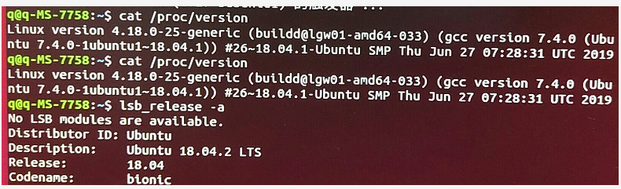
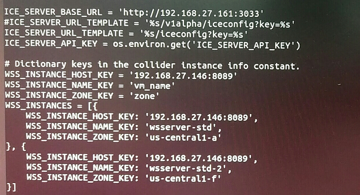
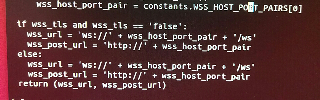
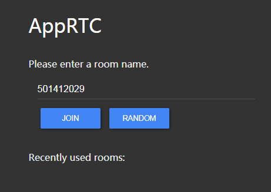
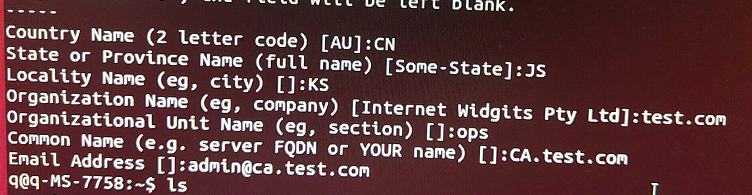
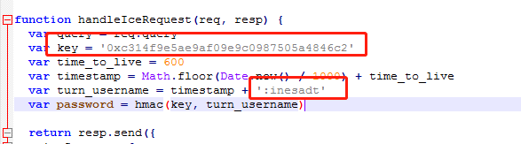

### Ubuntu环境

- 新安装的镜像，版本

```
cat/proc/version
```

```
lsb_release -a
```




### 搭建步骤

1：搭建Room Server(房间服务器),也就是AppRTC.

2：搭建信令服务器,在AppRTC中的src/Collider路径下.

3：搭建CoTURN服务器,用于音视频转发

4：搭建获取CoTURN服务器信息的服务器，也就是ICE REST API服务器.


### Room Server搭建

- 下载apprtc源码.

  1：

  ```
git clone https：//github.com/webrtc/apprtc.git
  ```

  报错：command 'git' not found,but can be installed with：sudo apt install git.

  运行：

  ```
sudo apt install git
  ```

  .安装成功继续上述命令,显示接收对象中,最终安装完成

  2：

  ```
cd apprtc
  ```

  3：

  ```
npm install
  ```

  报错：command ‘npm’ not found，but can be installed with：sudo apt install npm.

  运行：

  ```
sudo apt install npm
  ```

  安装成功继续上述命令.

  报错：Global Java not found or outdated,Dowloading OpenJDK-JRE-7u6_24 Failed：Sokcet hang up.

  手动安装JDK：

  ```
  add-apt-repository ppa：openjdk-r/ppa
  报错：比如使用root身份运行
  ```
  
  ```
  sudo  add-apt-repository ppa：openjdk-r/ppa
  ```
  
   运行完成
  
  2：
  
  ```
  apt-get update
  ```
  
  报错：无法打开锁文件,（权限不够）
  
  运行：
  
  ```
  sudo apt-get update
  ```
  
  运行完成.
  
  3：
  
  ```
  apt-get install openjdk-8-jdk
  ```
  
  报错：无法打开锁文件（权限不够）
  
  运行：
  
  ```
  sudo apt-get install openjdl-8-jdk
  ```
  
  运行完成.  
  
  继续上述第三步运行
  
  ```
  npm install
  ```
  
  报错：npm warn optional skipping failed optional dependency /chokidar/fsevents:
  
  ​           npm warn notsup not compatible with your operationg system or architecture：fsevents@1.2.9
  
  问题分析：主要是由于npm版本太低，可以通过升级npm版本,fsevent为mac os系统，linux下使用暂时忽略该警告.该问题目前不理会。继续下一步骤.

​      4：修改文件

​		  1：/apprtc/src/app_engine/constants.py,修改前先备份,cp constants.py constants_2.py,需要提前获取本机ip，输入如下命令：ifconfig -a提示:command ‘ifconfig’ not found，but can be install with sudo apt install net-tools.,运行apt install net-tools,运行完成，获取本机ip为：192.168.27.146,下图ICE_SERVER_BASE_URL的地址部署在我的macmini上.且ICE_SERVER_URL_TEMPLATE也要修改.



介绍：

ICE服务器：用于提供TURN和STUN的地址.端口号为3033.

WSS：信令服务器，端口号为8089,用于和房间服务器进行信令交互.

保存退出.	

​	

2：修改apprtc/src/app_engine/apprtc.py(若使用https,则不需要修改),备份 cp apprtc.py apprtc2.py



说明：修改配置的原因是屏蔽https请求，使用http请求,因为是局域网.


3：编译,在apprtc目录下运行

```
grunt build,
```

错误：command ‘grunt’ not found,but can be install with：sudo get apt install node-grunt-cli

运行如下

```
sudo get apt install node-grunt-cli
```

运行完成，继续上述运行.

错误：Import Error：No module named requests.原因预计两种：第一没有安装requests,第二python环境混乱.

解决方法：1:判断是否安装requests模块，命令sudo pip install requests,提示找不到pip命令，故先安装pip命令如下：sudo apt-get install python-pip.运行完成.继续运行sudo pip install requests,安装完成.继续运行grunt bulid.运行完成.可以看到在apprtc文件夹下创建了一个out文件夹.

房间服务器编译完成.


- 安装google引擎用于启动房间服务器

启动房间服务器需要google引擎,

说明：由于apprtc房间服务器是基于google app engine编写，故编译需要用到该工具,具体使用不需要太深入了解,只需要下载安装即可.


1：下载google app engine需要翻墙

<https://cloud.google.com/appengine/docs/standard/python/download#python_linux>

关于google app engine介绍：<https://cloud.google.com/appengine/docs/standard/python/download#python_linux>

2：解压google_appengine_1.9.38.zip(网盘中老版本文件,建议有可能的话使用最新版本.),

输入命令：unzip google_appengine_1.9.38.zip，运行完成.

3：编辑/etc/profile文件,配置环境变量.通过pwd命令可以查看当前目录.在/etc/profile文件中添加如下

export PATH="$PAHT:/home/q/google_appengine/"

生效配置：输入 source /etc/profile,完成.

4：在goole_appengine文件夹中运行./dev_appserver.py --host=192.168.27.146 /home/q/out/app_engine

出错：Import ERROR：cannot import name RAND_egd.

解决：找到对应的socket.py，找到import RAND_egd,去除该RAND_egd即可.预计新版本有可能该问题不存在.

再次运行提示：unable to bind 192.168.27.146:8080.

解决：查找8080端口被占用进程并杀死.输入如下：fuser -k 8080/tcp.

继续运行第四步，运行成功，在浏览器中输入：http：//192.168.27.146:8080弹出如下界面




后台运行输入：nohup ./dev_appserver.py --host=192.168.27.146 /home/q/apprtc/out/app_engine &		

以上为：房间服务器搭建成功. 需要使用FireFox 63.01版本，才能使用http调用getusermedia.


### 搭建信令服务器（Collider Server）

说明：用于接收房间服务器发送的信息,用于传递给同房间另一个用户.

1：安装go语言编译器,命令如下：sudo apt-get install golang-go

错误：有几个软件包无法下载.

解决方法：sudo apt-get update.运行完成后继续运行安装.运行成功.

2：复制collider源代码(从home/q/apprt/src/collider拷贝到home/q/下)

mkdir -p goWorkspace/src，运行成功

3：配置编译环境。命令如下：export GOPATH=/home/q/goWorkspace/，启用source /etc/profile

4：拷贝/apprtc/src/collider/目录文件到goworkspace/src目录下

cp -rf /home/q/apprtc/src/collider/*  /home/q/goWorkspace/src,运行完成

5：修改/goWorkspace/src/collidermain/main.go，修改房间服务器地址

var roomSrv = flag.String("room-server", "http://192.168.27.146:8080", "The origin of the room server")

6：在/goWorkspace/src/路径下编译信令服务器

命令：go get collidermain

错误：get websocket timeout.

解决方法：因为编译会涉及到翻墙，故需要手动下载net包，在/src/目录下输入如下命令：

mkdir -p golang.org/x

cd golang.org/x/

git clone https：//github.com/golang/net

错误：RPC failed,curl 56 GnuTLS recv error （-54）Error in the pull function.

解决方法：由于git默认缓存大小不足导致，需要增加缓存大小命令如下：

git config --global http.postBuffer 2000000000

继续上述下载命令，运行完成.继续调用编译命令运行成功.继续输入如下命令：

go install collidermain，运行成功.

进入/goWorkspacce/bin/目录运行信令服务器输入如下：

./collidermain -port=8089 -tls=false，运行成功

以上就是信令服务器编译成功.


### STUN/TURN服务器

说明：打洞服务器，用于获取客户端对应的出口ip.用于两个客户端之间进行通信.


1：安装coturn

命令：sudo apt-get install coturn,安装完成.

2：证书生成(用于配置文件中cert和pkey)

命令：sudo openssl req -x509 -newkey rsa：2048 -keyout /usr/local/etc/turn_server_pkey.pem -out /usr/local/etc/turn_server_cert.pem -days 99999 -nodes

出错：Cannot open file /crypto/rand/randfile.c,但是根据提示填写最终在目录下生成了文件.暂且不管.



3：创建coTURN用户.inesadt：为自己定义的用户名. 该用户名还将会被设置到ICE服务器中.

命令：sudo turnadmin -k -u inesadt -r 192.168.27.146 -p inesadt   

说明：-r 后面要跟着TURN的IP地址.否则TURN连接不通.


2：配置相关文件.

编辑文件/etc/default/coturn 。把TURNSERVER_ENABLED=1注释去掉.

编辑/etc/turnserver.conf，

```
listening-device = enp3s0

listening-port=3478

relay-device=enp3s0

min-port=49152

max-port=65535

fingerprint

lt-cred-mech

use-auth-secret

static-auth-secret=inesadt

user=inesadt:0x7e3a2ed35d3cf7f19e2f8b015a186f54
user=inesadt:inesadt

stale-nonce=600

cert=/usr/local/etc/turn_server_cert.pem
pkey=/usr/local/etc/turn_server_pkey.pem

no-loopback-peers

no-multicast-peers

mobility

no-cli
```

启动coTURN服务器

命令：sudo turnserver -v /etc/turnserver.conf


### 安装ice服务器

说明：ice服务器的原因是因为需要告诉用户TURN和STUN地址.

1：下载ice.js：<https://github.com/Piasy/WebRTC-Docker/tree/master/apprtc-server>

2：修改ice.js信息如下：key对应的生成的TURN用户时的随机数.inesadt为TURN配置的用户名.这两个在TURN搭建时就已经配置.



3：打开cmd下载安装js需要的npm 输入命令如下：npm install express

4：启动ice.js 命令如下：node ice.js

以上为ice服务器的启动，主要创建ice服务器的原因在与用户直接需要通过ice服务器获取TURN和STUN服务器地址.


### 测试

启动房间服务器：nohup ./dev_appserver.py --host=192.168.27.146 /home/q/apprtc/out/app_engine &		

启动信令服务器：./collidermain -port=8089 -tls=false &

启动coTURN服务器：sudo turnserver -v /etc/turnserver.conf

打开浏览器：firefox 版本63.0.1,输入：http：//192.168.27.146:8080.登录房间,既可以看到两端互通.

注意：不能使用google,（http下调用getUserMedia失败）,firefox不能使用高版本,getusermeida也失败.

firefox下载：<http://ftp.mozilla.org/pub/firefox/releases/>

在firefox浏览器中点击设置，选择手动更新，否则会升级到最新版本.这样就会导致不能正常使用.

编译room服务器 grunt build，启动房间服务器,TURN服务器.android与pc连接互通.


