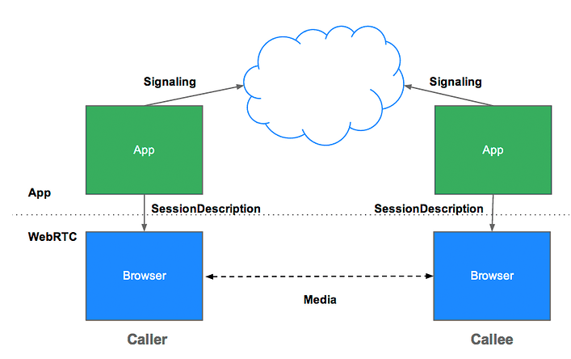
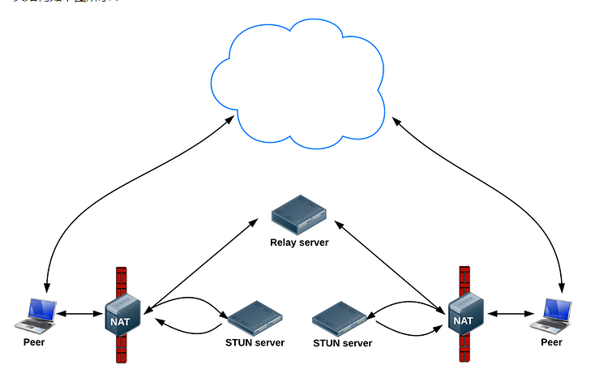
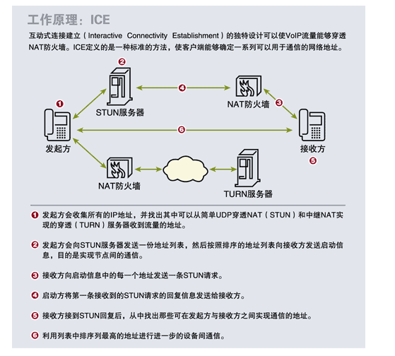
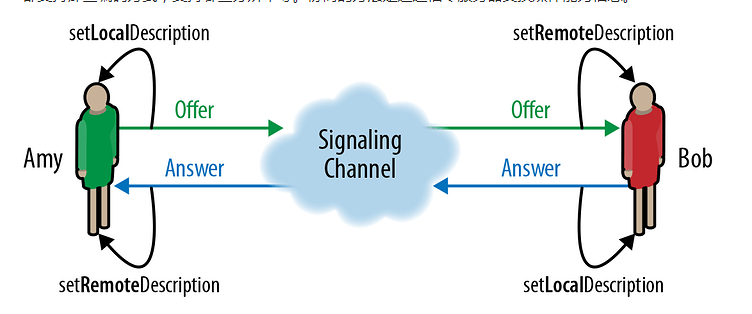
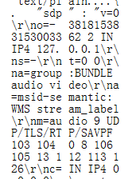
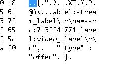
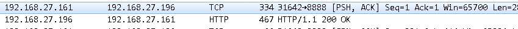
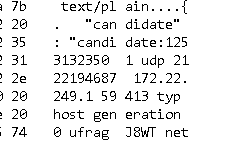
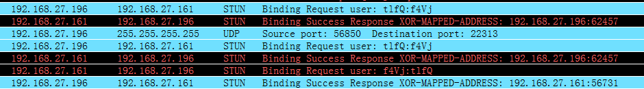

### 信令

信令服务器主要用于交换三种类型的信息：

1：会话控制消息：初始化/关闭,各种业务逻辑消息以及错误报告等。

2：网络相关：外部可以识别的IP地址和端口.

3：媒体能力：客户端能控制的编解码器,分辨率等相关信息.

#### 会话控制消息

会话控制消息比较简单，像房间的创建与销毁，加入房间，离开房间，开启音频/关闭音频,开启视频/关闭视频等等.

#### 网络信息消息

网络信息消息用于两个客户端之间交换网络信息。在WebRTC中使用ICE机制建立网络连接.WebRTC中有三种类型的候选者，分别为：主机候选者，反射候选者，中继候选者。

主机候选者：表示的是本地局域网内的IP地址和端口,他是三个候选者中优先级最高的，也就是说WebRtc底层,首先会尝试本地局域网内建立连接.

反对候选者：表示的是获取NAT内主机的外网IP地址和端口。

在这幅图可以看出，webRTC通过STUN server获得自己的外网IP和端口,然后通过信令服务器与远端的WebRTC交换网络信息.之后就可以建立P2P连接.如果NAT打洞失败,则只能试用中继候选者.

中继候选者：表示的是中继服务器的IP地址和端口,即通过服务器中转媒体数据.

ICE简介

ICE：interactive connectivity establishment(交互式连接建立)并非一种新的协议，它不需要对STUN，TURN进行扩展就可以适用于各种NAT，ICE只需要定义一些SDP(Session Description Protocol)附加属性即可.

ICE是提供客户端穿越能力的有力武器，只要在两个客户端之间确实存在一条可以通行的路径，ICE就一定能找到,并且该路径是两个客户端路径中最高效的最节省资源的。中继传输方式优先级最低.

webRTC优化为五步：收集候选地址，在信令通道中交换候选选项，执行连接检查，选定并启动媒体.

客户端找到本地对应的所有candidate,然后利用信令服务器发送给对端，对端利用收到的candiate信息访问对应的STUN服务器验证是否能够打通.

#### 交换媒体能力消息

在WebRTC中，媒体能力最终通过SDP呈现,在传输媒体数据之前，首先要进行媒体能力协商，看双发都支持哪些编码方式和分辨率等.

1：Amy调用Createoffer创建offer消息，offer消息中的内容是Amy的SDP信息.

2：Amy调用setLocalDescription方法，将本段的SDP信息保存起来.

3：Amy将offer消息通过信令服务器传给Bob.

4：Bob收到offer消息后，调用setRemoteDescription方法将其保存起来.

5：Bob调用CreateAnswer创建anwser消息，同样anwser消息里保存的是Bob的SDP信息.

6：Bob调用setLocalDescription方法，将本端的SDP保存起来.

7：Bob将anwser消息通过信令服务器传给Amy.

8：Amy收到anwser消息后，调用setRemoteDescription方法,将其保存起来.

以上就是媒体能力交互.客户端通过offer和Answer创建SDP数据格式,然后通过信令服务器发送给对方.

通过抓包可以看出sdp发送流程如下：

客户端创建offer进行发送.

客户端开始发送candidate信息.

客户端利用ICE协议每次获取一个Candidate都会发送给接收端.而接收端也会在每收到一个candidate都会检查他的有效性.

上图可以看在收到对端的candidate后，本地会向对端STUN发送连通性检查,对端STUN会返回Response.

以上就是利用ICE进行网络连通的流程.如果需要获取媒体格式信息，则需要分析SDP格式.

### SDP

地址:<https://tools.ietf.org/html/rfc4566>

介绍

sdp：是一种会话传输格式，并不是传输协议，该格式可以被很多协议进行传输.

v=0 会话描述协议的版本,一般为0.

o=-  39559869  189962807572  IN  IP4  127.0.0.1

s=-

t=0  0

m= audio 9 UDP/TLS/RTP/SAVP F 103 104 

c=IN IP4 0.0.0.0

o=<username> <sess-id> <sess-version> <nettype> <addrtype> <unicast-address>

<username>：用户在原始主机上的登录名,如果原始主机不支持用户id的概念可以为'-'，但是不能为空.

<sess-id>：是一个数字字符串,构成全局唯一性.一般由Network Time Protocol的时间戳构建.

<sess-version>:会话描述版本号,一般也有Network Time Protocol的时间戳构建.

<nettype>：网路类型的字符串,"IN"意思就是"Internet"

<addrtype>：地址类型的字符串,定义了"IP4"和“IP6”,

<unicast-address>：创建会话的机器地址.

s=<session name>：文本会话名称，每个SDP必须有且仅有一个,不能为空.

t=<start-time> <stop-time>：指定开始和结束时间针对一个会话.开始和结束都为0被认为该会话为永久性.

a=<attribute>：<value>：属性对应的值.

m=<media><port><proto><fmt>...

<media>：媒体类型,当前默认有,audio,viedo,text,application,message,

<port>：媒体流传输端口.

<proto>：传输协议.

c=<nettype> <addrtype> <connection-address>

<nettype>：网络类型字符串,“IN”默认的是"Internet"

<addrtype>：地址类型字符串，默认只有IP4，IP6

<connection-address>:连接地址.

a=framerate:<frame rate>:最大的视频帧率,用于视频编码.

a=quality:<quality>：编码质量提供建议,取值为0-10,0：糟糕的编码质量建议.5：没有建议.10：好的编码质量建议.

b=<bwtype>：<bandwidth>:设置当前会话或媒体的带宽限制.

<bwtype>：CT：总带宽，AS：单个媒体带宽的最大值.

### 总结

通过信令交互实现客户端直连,利用sdp可以配置一些媒体信息.