## 即构科技

ZEGO实时音视频云服务提供全球一站式音视频服务，产品涵盖直播，社交，游戏，金融，医疗等关键领域.

开发者中心：<https://www.zego.im/html/document/>

### 互动视频直播

#### 场景

AI教育，KTV合唱，视频直播，视频通话，游戏直播，直播答题

#### 功能

1：多主播同框互动 ：多个主播或者主播和观众进行连麦互动，观众在各种终端能看到多主播连麦实况.

2：支持微信小程序 ：利用微信小程序音视频能力，完全兼容微信小程序.

3：互通连麦：小程序和APP互通，全终端互通连麦.

4：美颜和挂件功能：自带美颜功能，同时开放音视频前处理接口，支持接入第三方美声，变声，美颜，水印，挂件和弹幕等功能.

5：支持推流端，云端，拉流端混流多种方式，云导播台允许把多路语音视频流进行自由混编

6：支持录制，存储，点播功能，混流服务更是允许将多路流进行混和录制

#### 自研语音视频引擎

前处理：

1：回声消除AEC

2：噪声抑制ANS

3：音量增益AGC

自适应负责网络：

1：抖动缓冲

2：前向纠错

3：丢帧补偿

其他：

1：支持外部采集 ：开放采集接口，允许外部采集，从现有音频流，音频文件，或者定制的采集系统中获得采集输入

2：编解码耗能低 ：允许自行定制编码器

3：前处理开放： 允许自行定制语音前处理(混响，美声，变声等).

#### 连麦系统架构图

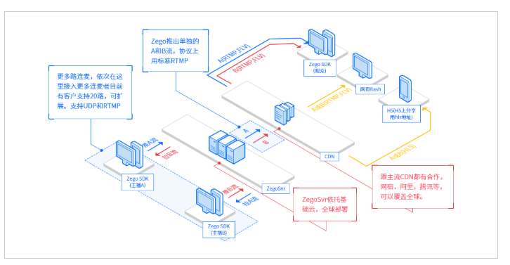

### 实时语音

ZEGO语音通话是一款实时的语音通话产品，能够为开发者提供便捷接入，流畅高音质，多平台，低延迟，高并发的音频直播服务,可以实现一对多，多对多的实时音频互动，语音聊天，直播K房等场景.

#### 场景

语音直播，语音通话，游戏语音。

#### 功能

1：支持RTMP,FLV,HLS和RTP等协议推拉流，本地录制，音效变声等

2：自定义音频前处理，自定影音频采集与渲染，多路混流，音频加解密

3：自研音频引擎

4：网络传输, QOS，网络自适应，抖动缓冲等.

### WebRTC网关服务器

#### 地址[https://www.zego.im/article/2018/07/23/%E5%8D%B3%E6%9E%84%E8%87%AA%E7%A0%94webrtc%E7%BD%91%E5%85%B3%E6%9C%8D%E5%8A%A1%E5%99%A8%E6%9E%B6%E6%9E%84%E5%AE%9E%E8%B7%B5/](https://www.zego.im/article/2018/07/23/即构自研webrtc网关服务器架构实践/)

在加入WebRTC网关之前，即构自研系统架构如下图所示：

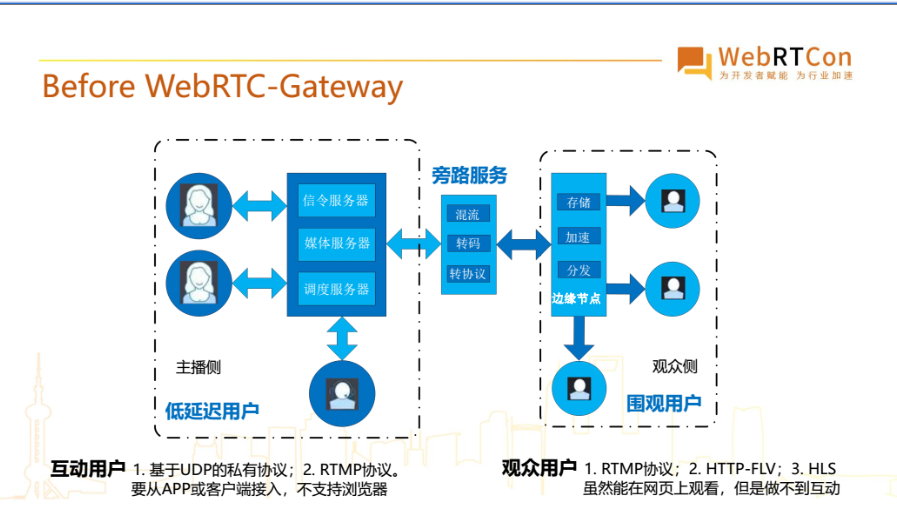

由于RTMP的实时性不好，在浏览器端没有办法通过RTMP进行上行传输达到低延时的特点,所以即构对原有的系统架构进行了升级，在低延时的实时传输网络中加入了WebRTC网关服务器.如下图：

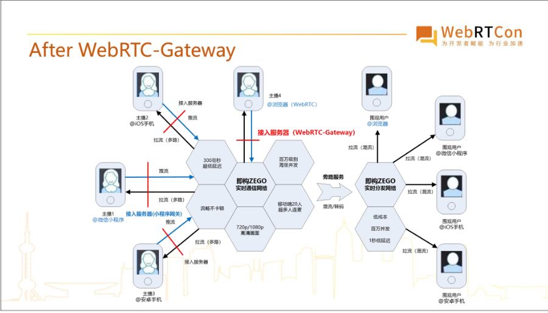

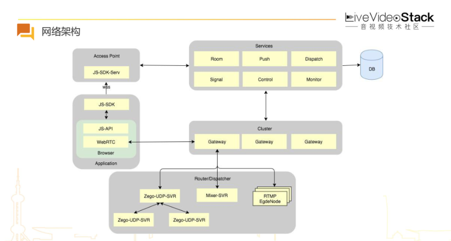

如上图可以看到：左边是浏览器端的接入方式,右上角是后台房间,信令等服务,中间就是Gateway.

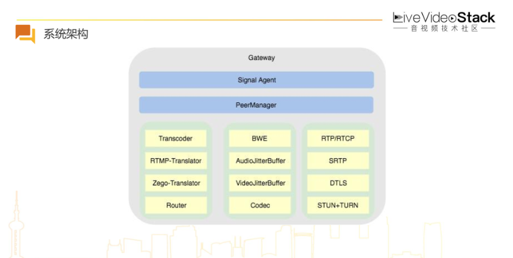

上图是Gateway的系统架构，与WebRTC的架构图十分类似,可以发现大多数开源项目只包含最右边的四个模块,如果只是需要实现WebRTC网关,只需要右边的四个模块,就可以搭建一个最简单的服务器架构.但是若想实现功能较为完善的WebRTC网关，MCU模型,路由带宽预测,JitterBuffer，Codec等都是需要实现的模块.

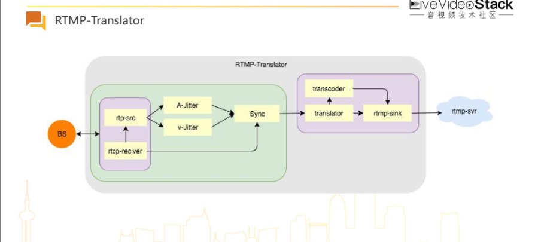

上图所示是非常典型的RTMP的转协议流程,左边是浏览器,中间是RTP,RTCP的模块,右边是RTMP模块.上述主要初步介绍了一下即构的WebRTC网关服务器架构,具体细节在此不做分析.

### 连麦直播的技术难点和解决思路

#### 场景

1：视频直播中的多主播连麦场景.

2：线上抓娃娃,视频直播与物联网的结合.

3：直播答题。

#### 要求

1：延迟足够低.

2：回声消除.

3：流畅不卡顿.

1:低延迟架构

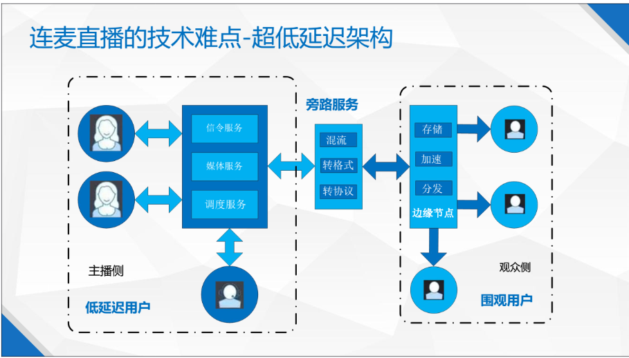

市面上做连麦直播解决方案的系统架构普遍大概这个样子，左边是低延迟网络，为需要低延迟的用户提供连麦互动直播服务，成本较高。右边内容为分发网络，为围观用户提供视频直播服务，虽然延迟稍微高一点，但是成本较低而且支持更高的开发。中间通过一个旁路服务连接，旁路服务器从低延迟的实时网络中把音视频数据拉出来，有选择行的进行混流，格式转换或者协议转换等处理，然后推到内容分发网络，然后通过内容分发网络分发给围观用户。

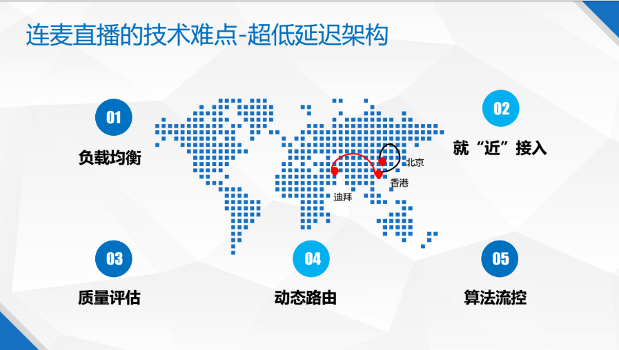

要构建超低延迟的实时系统架构，需要考虑如下几个点：

1：负载均衡。任何一个网络节点必须均衡的负载用户，如果某一个网络节点的用户访问量超过了它能够承载的上限，容易出现丢包的情况，会触发网络拥塞，从而引起更多的丢包，导致用户体验不好.

2：就近接入.网络上的“近”和我们理解的直线上的近是不一样的，这个可以类比交通网络，要考虑两点：第一点连通性，尽管AB两点看起来很近，但是没有直通的道路,就相当于网络的不连通.第二点拥堵状况,如果道路出现很短，但是出现拥堵，那也不见得近.

3：质量评估.回顾过去的数据，分析某一个地区的用户在各个时间点推流到某地区的数据，总结出哪个时间点走哪条路径比较好的方案，然后人为的将相关数据配置到实时传输网络,提高传输质量.

2：回声消除

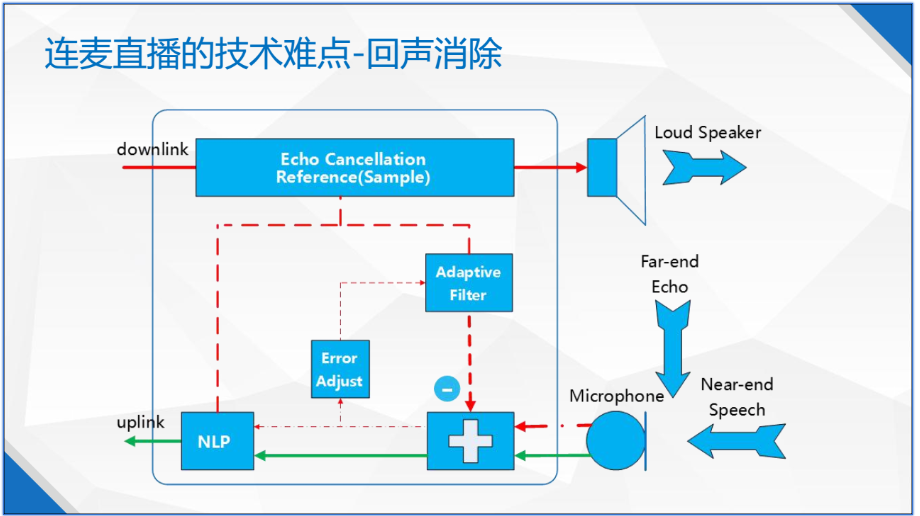

实现原理：通过参考信号作为函数的输入，模拟出回声信号，再把麦克风采集到声音信号减去模拟回声信号，最终达到回声消除的目的.我们通过滤波器来实现这个函数，滤波器会不断的学习和收敛，模拟回声信号，使模拟回声尽量逼近回声信号，然后将麦克风采集进来的声音信号减去模拟回声信号，达到回声消除的目的,这个步骤也称为线性处理.

回声有三种场景类型：静音，单讲和双讲。对于单讲来说，线性处理后抑制的效果会比较好，回声消除的比较干净，对于双讲来说,线性处理后抑制的效果就不是那么好，这时就需要采取第二个步骤：非线性处理,把剩余的回声消除干净.非线性处理没有太多开源的东西参考，要靠各厂家自己研究.

3：抖动缓冲

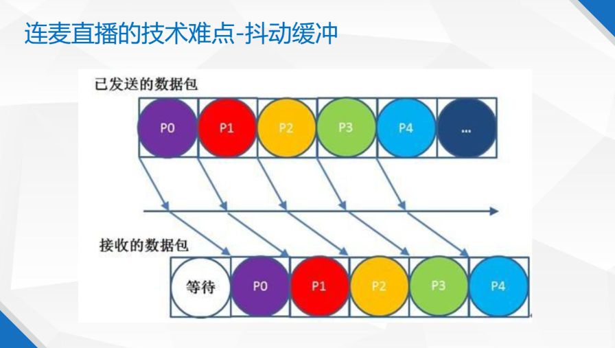

网络中存在拥塞，丢包，乱序和抖动，因此网络传输会带来数据损伤.基于UDP的私有协议来传输语音视频数据的时候需要做抖动缓冲.以WebRTC为例，对音频数据的抖动缓冲叫NetEQ，视频数据的缓冲叫JitterBuffer.

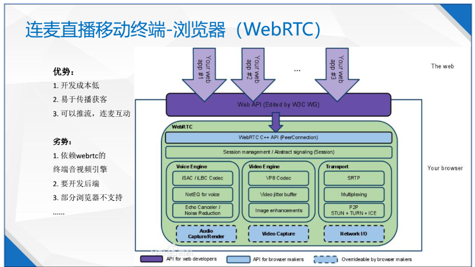

### 结语

通过即构可以了解到，连麦直播技术逐步在原生APP，浏览器H5，浏览器WebRTC，微信小程序上延伸,衍生出更加丰富的生态，提供更加便捷和良好的用户体验.开发者要充分理解这些类型终端的特点和局限,才能更好地在上面利用连麦技术进行创新.

### 即构demo连麦调研

### 连麦简介

- 连麦模式：指主播开播过程中可以和其他主播或者观众进行连麦，进行互动交流，包括纯语音的互动和音视频的互动。以连麦模式开播，两个参与互动的主播是推流到即构的流媒体服务器，然后由即构流媒体服务器在推到CDN，实现低延迟的互动交流，两个互动主播走基于UDP的私有协议，延迟时间在200-500ms之间.
- 混流模式：是指在连麦模式的基础上，通过即构的混流服务器，将多路单流混合成一路流并将混流输出到CDN，这时观众只需要拉一条流就可以看到多个主播的画面了.
- 普通连麦与混流连麦的区别：对于连麦主播之间这两个模式是没有区别的，主要区别在观众端拉流.
- 普通连麦模式：观众需要拉两条流，渲染两个画面，自定义布局,但是对观众来说带宽和性能会有所增加.
- 混流连麦模式：观众只需要拉一条在ZEGO混流服务器混好的流，渲染一个画面就可以看到两个主播的画面，减少观众带宽和性能负担.但是画面布局固定.
- 即构目前提供PC端支持32路连麦，移动端支持20路连麦.

### 主播-观众连麦

目前SDK提供了主播与观众的连麦功能，支持主播与观众互动，直播中的连麦分为两种情况：

1：观众向主播申请连麦

2：主播邀请观众连麦

连麦架构图如下

利用demo测试流程如下

### A主播

- 选取连麦模式,视频质量为标准质量,上麦分辨率360*640,帧率15FPS.视频码率在700kbps，音频码率50kbps

直播推流中可以动态设置美颜滤镜等.

通过VLC观看A主播推流RTMP地址如下

### B主播

- 申请连麦

  在房间列表中选中直播房间号点击连麦

  

A主播同意连麦请求

可看到AB主播出现在同一画面中.

通过A主播日志可以看到此时A主播新增一条数据流.通过VLC可以进行成功播放新增数据流.

### 用户

当前模式下最终用户需要通过拉去两条流进行连麦观看.如果是混流模式连麦的话客户只需要拉去一个流进行观看即可.

### AB主播连麦延迟

当前网络条件下(qiju wifi),通过测试可知在AB主播之间从采集到传输到对端渲染延迟大约700-800ms左右,与官网提供的延迟在200-500ms存在误差,初步怀疑有可能是网络环境造成.

### 主播与客户之间延迟

当前环境下经测试主播从采集到客户观看中间延时大约3-4s左右.